# Store Snapshot Pattern - Architecture Diagrams

**Visual Reference for System Design & Data Flow**

---

## 1. Database Schema Architecture

### Before: Separate Collections (Legacy)

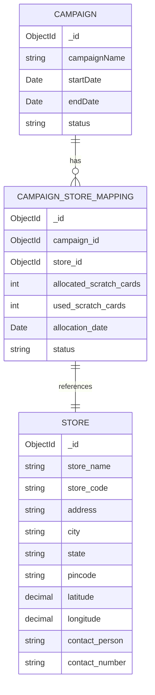

**Problems**:
- ❌ Three separate collections
- ❌ Runtime lookups required
- ❌ Store changes affect campaigns
- ❌ No historical data
- ❌ Delete cascades risk

---

### After: Embedded Snapshots (New Pattern)

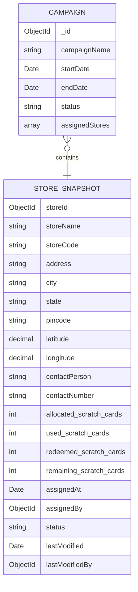

**Benefits**:
- ✅ Single document
- ✅ No external lookups
- ✅ Immutable snapshots
- ✅ Complete history
- ✅ No delete risk

---

## 2. Query Optimization: Before vs After

### Campaign Detail Query Flow

#### Before (Legacy - 3 Queries)

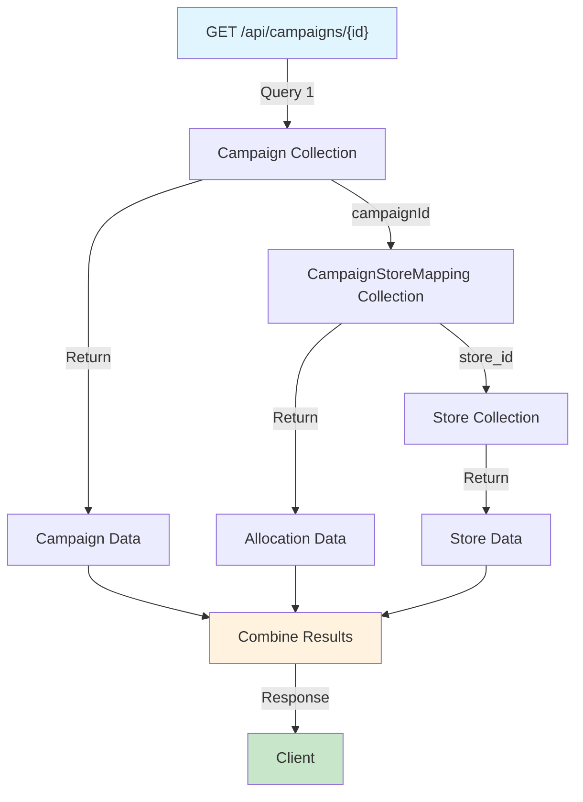

**Issues**:
- 3 separate database queries
- Store changes affect display
- Slow response (500-800ms)
- Join operations required

---

#### After (Snapshots - 1 Query)

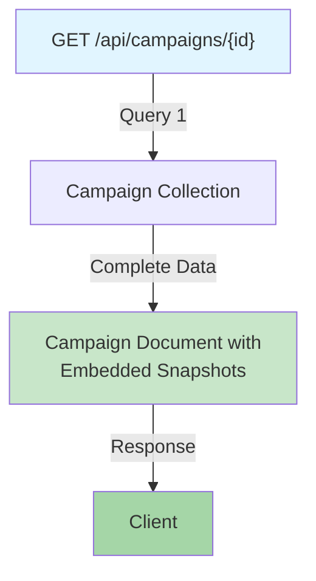

**Benefits**:
- Single database query
- All data in one document
- Fast response (<200ms)
- No join operations

---

## 3. Campaign Assignment Flow

### Assignment Process

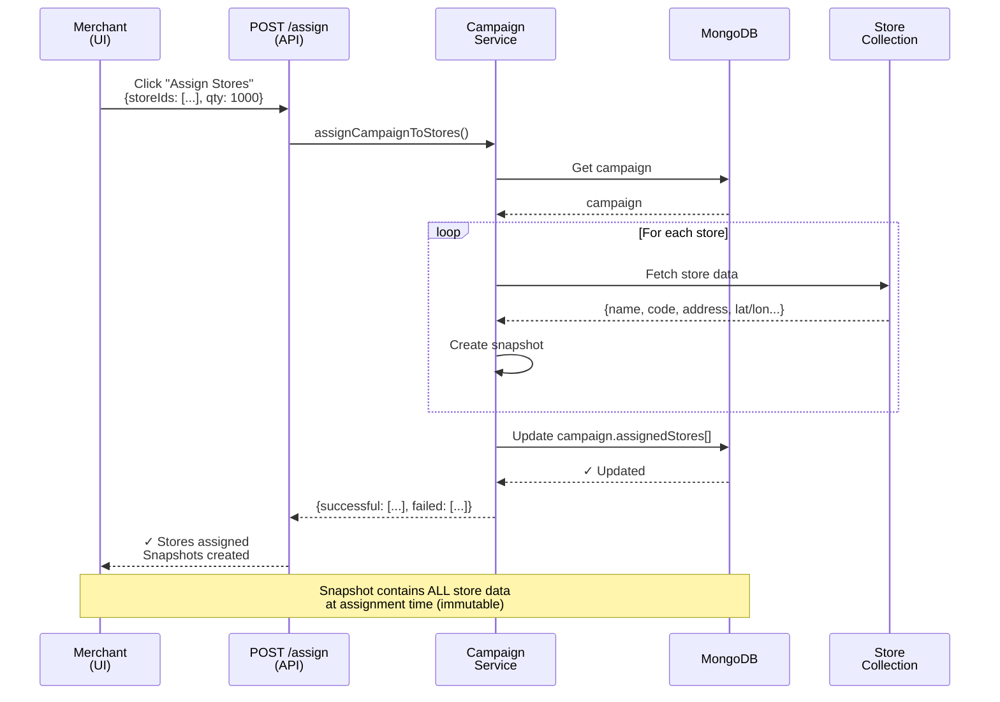

---

## 4. QR Validation Flow

### Before: Store Collection Lookup

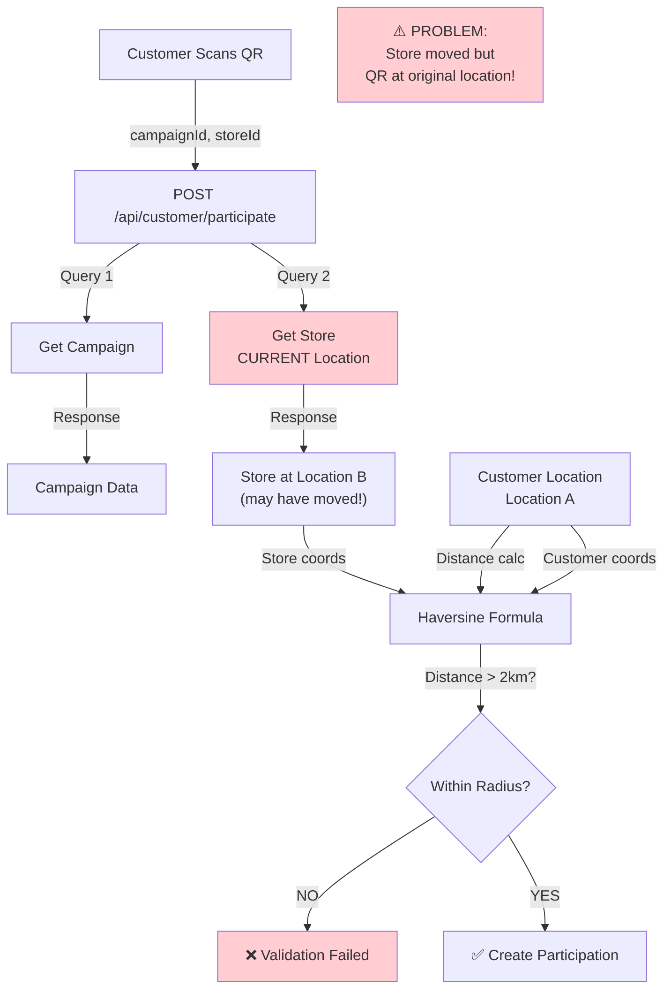

---

### After: Snapshot Location

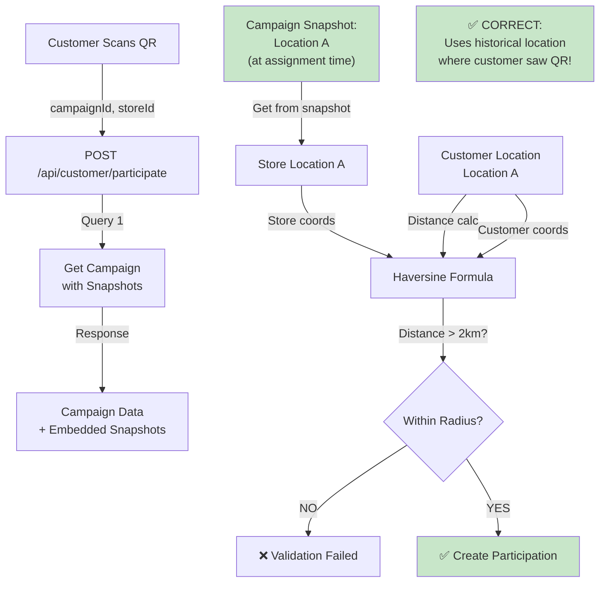

---

## 5. Data Consistency: Store Update Scenario

### Scenario: Store Moves After Campaign Assignment

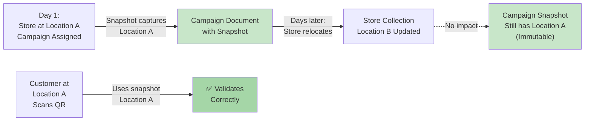

---

## 6. System Architecture Overview

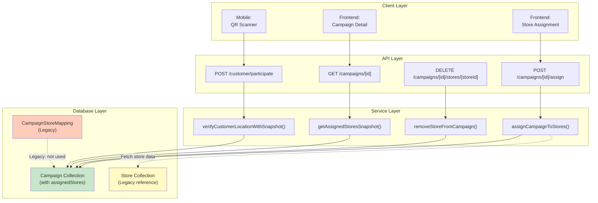

---

## 7. Migration Data Flow

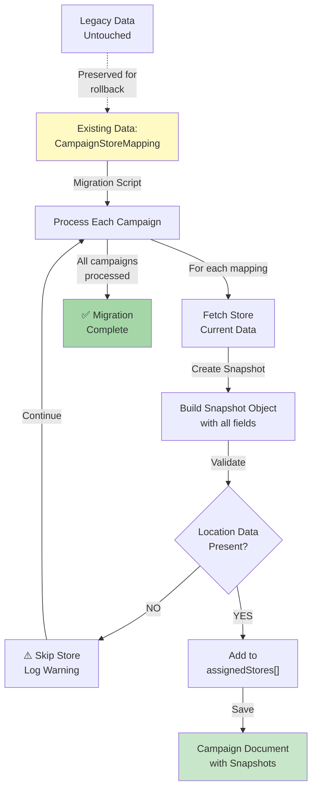

---

## 8. Soft Delete: Status Transitions

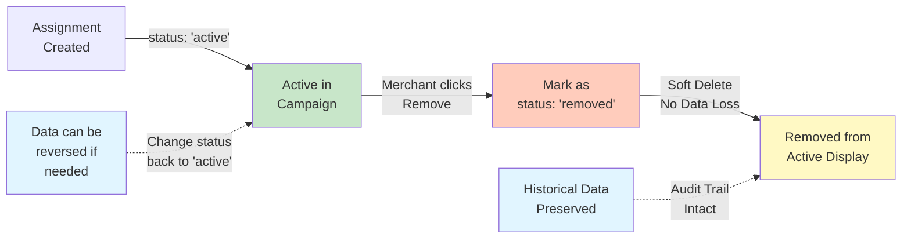

---

## 9. Performance Comparison

### Query Volume Reduction

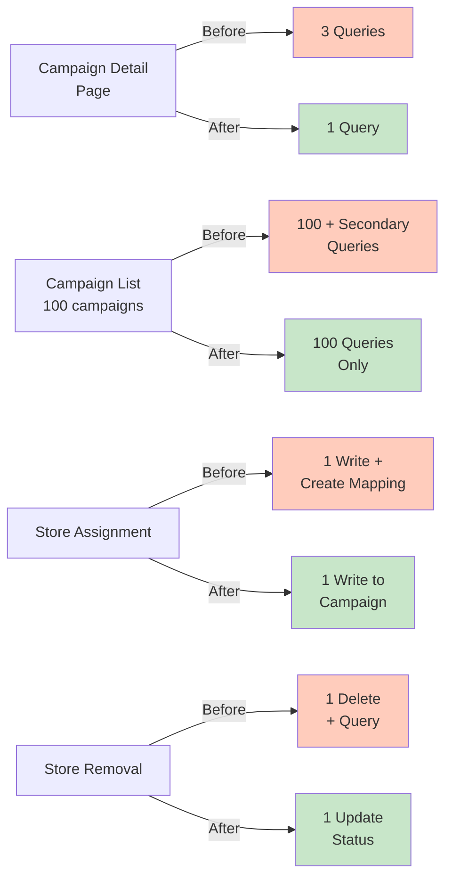

---

## 10. Index Strategy

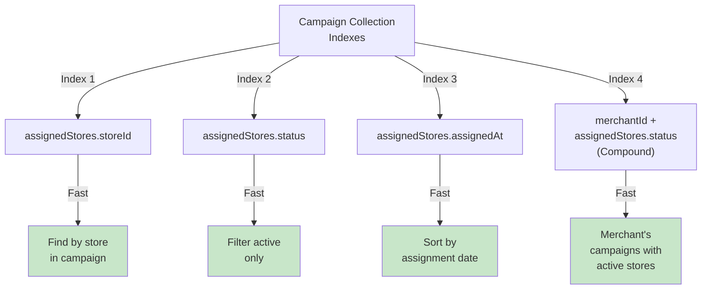

---

## 11. Backward Compatibility During Migration

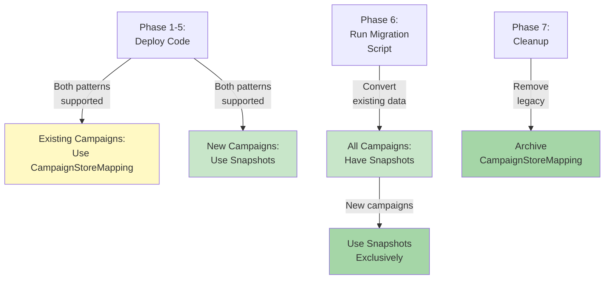

---

## 12. API Response Evolution

### Assignment Endpoint Response

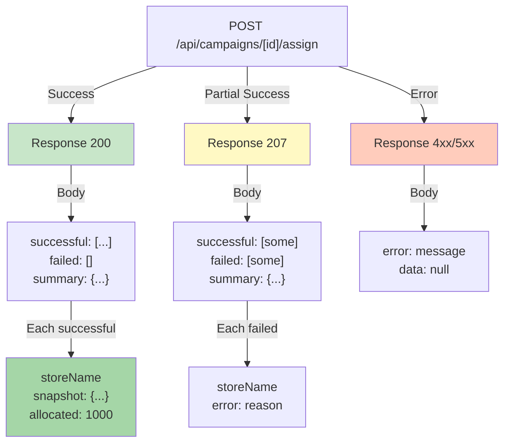

---

## 13. Complete System Integration

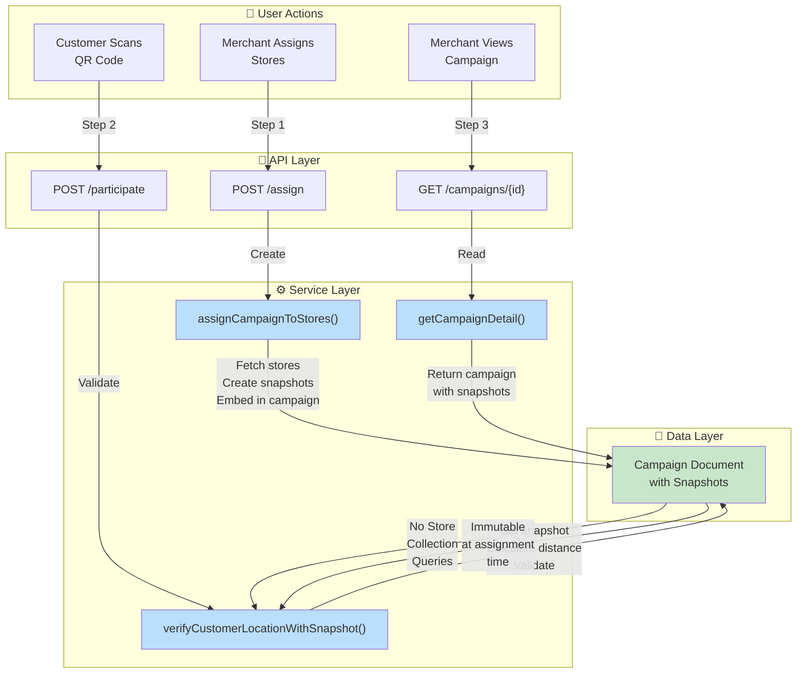

---

## 14. Error Handling Flow

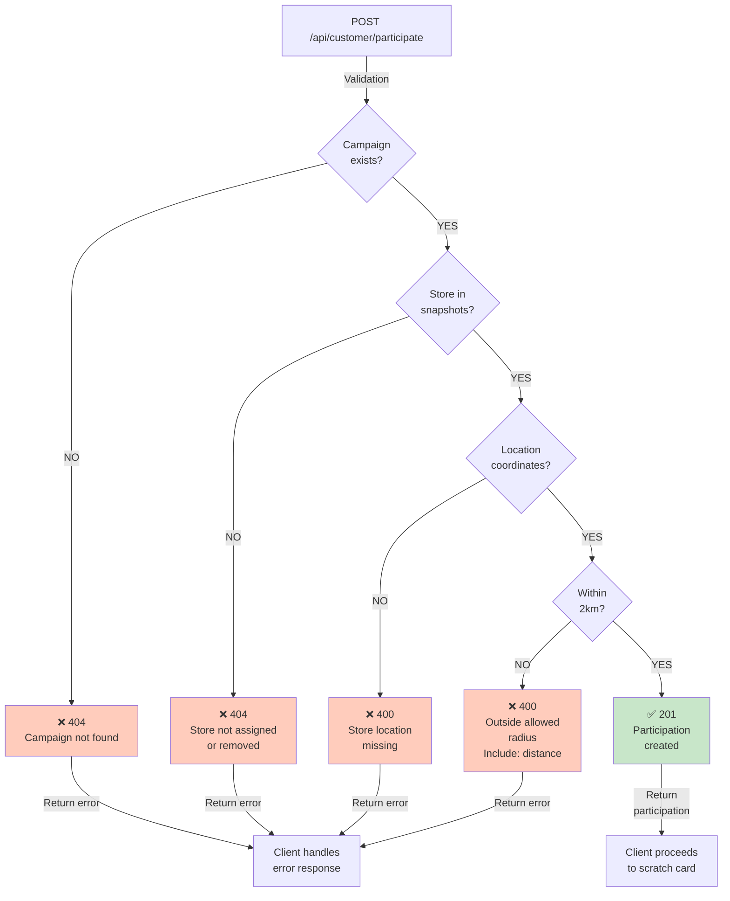

---

## Summary

These diagrams illustrate:

1. **Schema Evolution**: From 3 separate collections to 1 embedded document
2. **Query Optimization**: From 3+ queries to 1 single query
3. **Data Flow**: Complete request/response cycles
4. **QR Validation**: Historical accuracy with immutable snapshots
5. **System Architecture**: All components working together
6. **Migration Process**: Non-destructive data conversion
7. **Data Integrity**: Soft delete and audit trail
8. **Performance**: Query reduction and speed improvements
9. **Backward Compatibility**: Gradual migration support
10. **Error Handling**: Comprehensive validation at each step

All diagrams can be rendered using Mermaid (https://mermaid.js.org/) for clear visualization.
